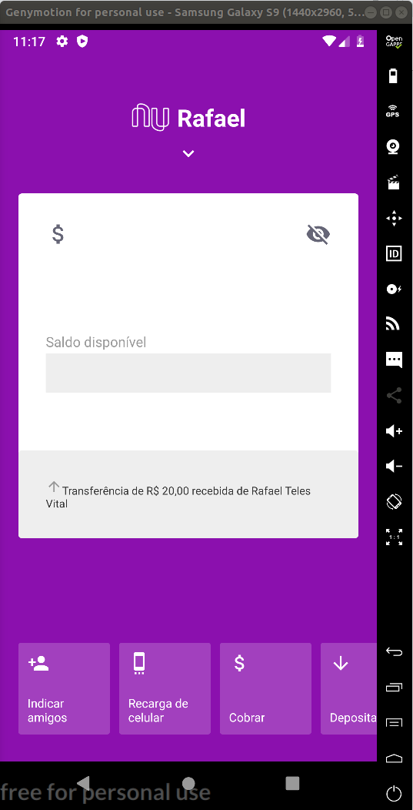
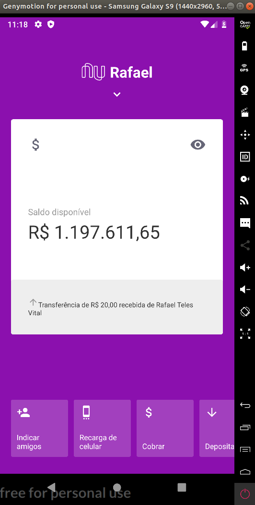
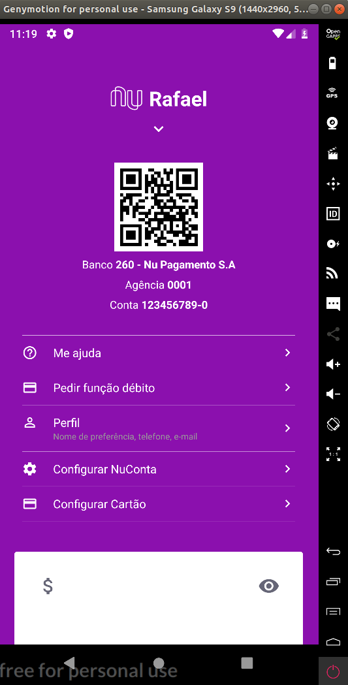

<!--
*** Obrigado por estar vendo o nosso README. Se você tiver alguma sugestão
*** que possa melhorá-lo ainda mais dê um fork no repositório e crie uma Pull
*** Request ou abra uma Issue com a tag "sugestão".
*** Obrigado novamente! Agora vamos falar desse projeto incrível :D
-->

## Tecnologias/Ferramentas utilizadas

- Animated (react-native);
- react-native;
- react-native-qrcode-svg;
- styled-components;
- react-native-gesture-handler;
- eslint;
- eslint-plugin-import-helpers;
- react-native-vector-icons/MaterialIcons;
- react-hooks.
- reactotron-react-native.
- react-navigation

## Demonstração

## Contribuição

1. Faça um Fork do projeto
2. Crie uma Branch para sua Feature (`git checkout -b feature/FeatureIncrivel`)
3. Adicione suas mudanças (`git add .`)
4. Comite suas mudanças (`git commit -m 'Adicionando uma Feature incrível!`)
5. Faça o Push da Branch (`git push origin feature/FeatureIncrivel`)
6. Abra uma Pull Request

<!-- CONTACT -->

## Contato

Rafael -> [Github](https://github.com/devteles) - **te_teles@hotmail.com**
Linkedin: https://www.linkedin.com/in/rafael-teles-vital-9002946a/
